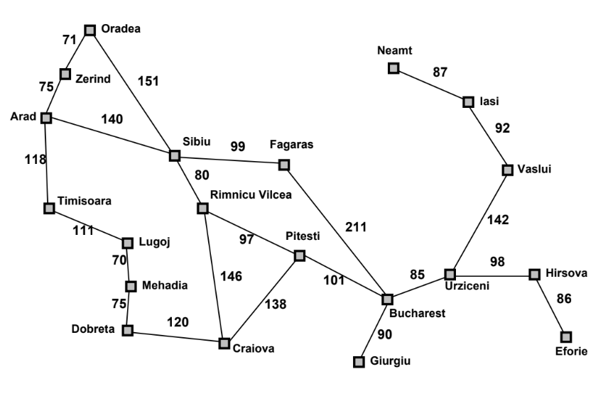
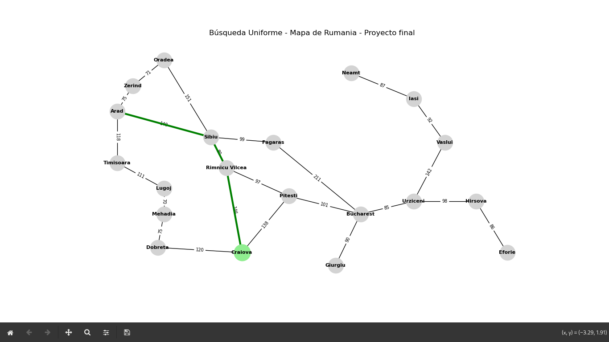
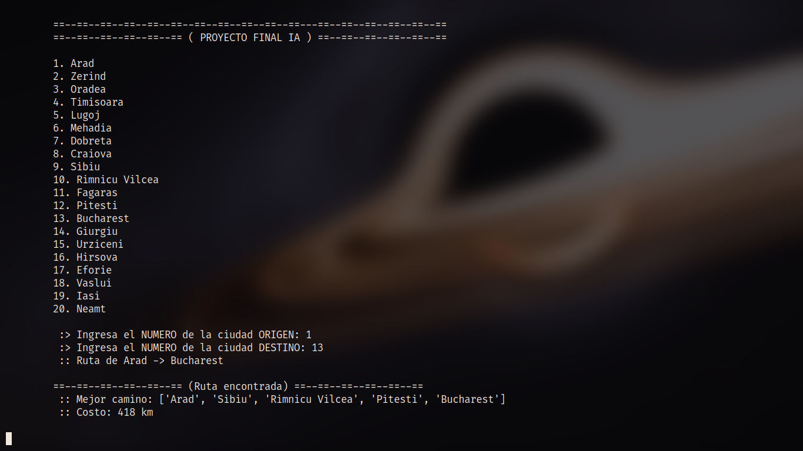

# Proyecto Inteligencia Artificial
-
## Busqueda uniforme
En cada paso, el algoritmo selecciona el nodo cuya ruta desde el inicio tiene el costo acumulado más bajo. Esto garantiza que siempre se explore primero el camino de menor costo posible.

### Mapa de Romania
</img>

### Ejemplo de salida del programa
Al programa se le indica el número de las ciudades enlistadas, el usuario ingresa la ciudad de origen y la ciudad destino
</img>

Posteriormente se dibuja el mapa donde se hace la simulación de las ciudades visitadas
</img>

Por último se muestra en terminal el camino que se obtuvo así como su costo total
</img>